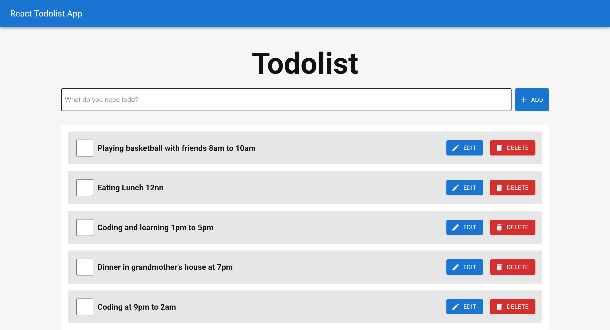

# Todolist app

## Table of contents

- [Overview](#overview)
  - [Screenshot](#screenshot)
  - [Links](#links)
- [My process](#my-process)
  - [Built with](#built-with)
- [Author](#author)

## Overview

### Screenshot



### Links

- Solution URL: [https://github.com/ErysCode7/todolist-app](https://github.com/ErysCode7/todolist-app)
- Live Site URL: [https://todolist-app-nu.vercel.app/](https://todolist-app-nu.vercel.app/)

1. Clone the repo

   ```sh
   git clone git@github.com:ErysCode7/todolist-app.git
   ```

2. Install NPM packages

   ```sh
   npm install
   ```

3. Run app

   ```sh
   npm start
   ```

## My process

### Built with

- React
- Material Icons
- BEM
- SASS

## Author

- Facebook - [Erys Mozo](https://web.facebook.com/erys.mozo/)
- Instagram - [\_erysmozo](https://www.instagram.com/_erysmozo/)
- Frontend Mentor - [ErysCode7](https://www.frontendmentor.io/profile/ErysCode7)
- LinkedIn - [Erys Mozo](https://www.linkedin.com/in/erys-mozo-280190230/)
